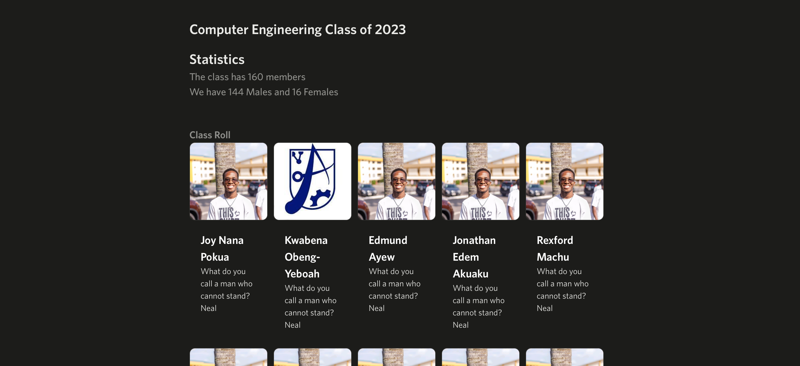

Experimental demo version for class digital year book with NextJS.      

Add image domains to next.config.js because of nextjs rules to ensure loading       

Add data to /lib/data.ts        

Here is a preview:      

